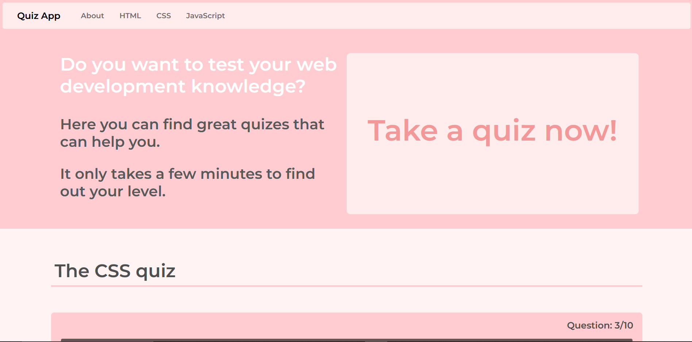
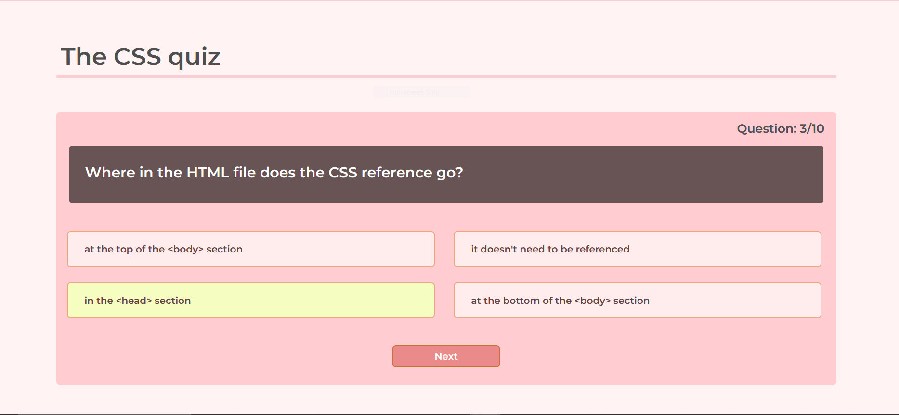
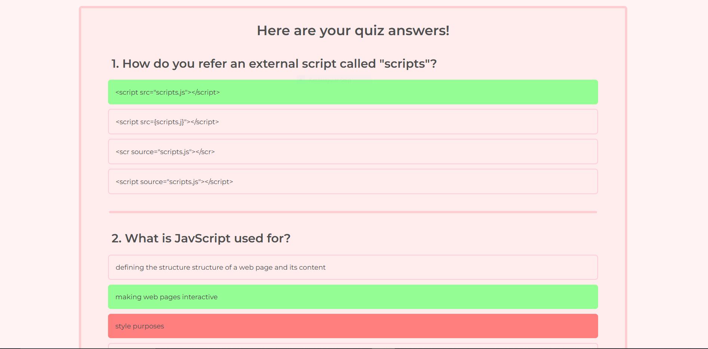
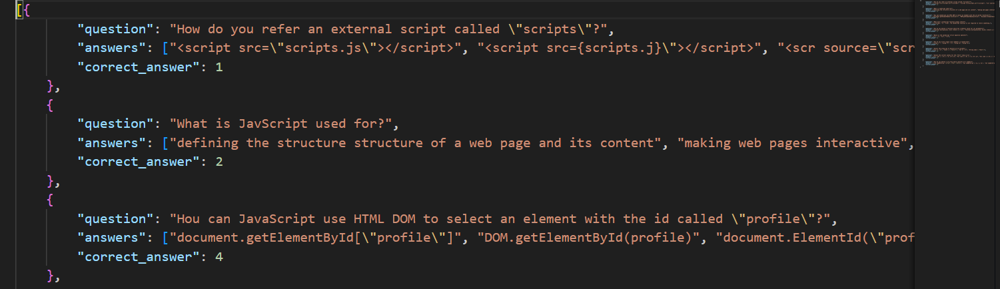

# Quiz App
This is an responsive and accessible application made to test your basic knowledge in front-end web development. 
With the use of Javascript, jQuery, local JSON files, Bootstrap, plain CSS and HTML this app provides an useful tool for practicing and learning.

The quiz header and welcome area

Quiz appearance

The quiz report showing the answer green if the user was correct or red if the user chose the wrong one.

Each quiz has the questions stored in a local JSON file that has the following structure:

**App description:**: 
- The app contains a header with buttons for the about section and the three quizes available.
- Below it is the welcome area which contains a message and an animated text.
- The quiz questions, answers and the number of the right answer are stored in local JSON files and are fetched and saved in local variables on the app opening.
- The quiz itself for every of the 3 topics has 4 answers, only one of them being correct.
- Once an answer is selected the user can go to the next question until the quiz is over.
- After finishing a quiz, the user gets a report of the answers, which highlights with green the correct answers and with red the wrong ones (along with the green colored correct one).
- A quiz can be restarted after ending it or reading the report.
- Exiting a quiz in the process of completing it comes with a warning window that states that the progress will be lost.
- The app is responsive on every device, with the use of Bootstrap and CSS.

## Live App
https://sndr-23-56.github.io/Quiz-App/
